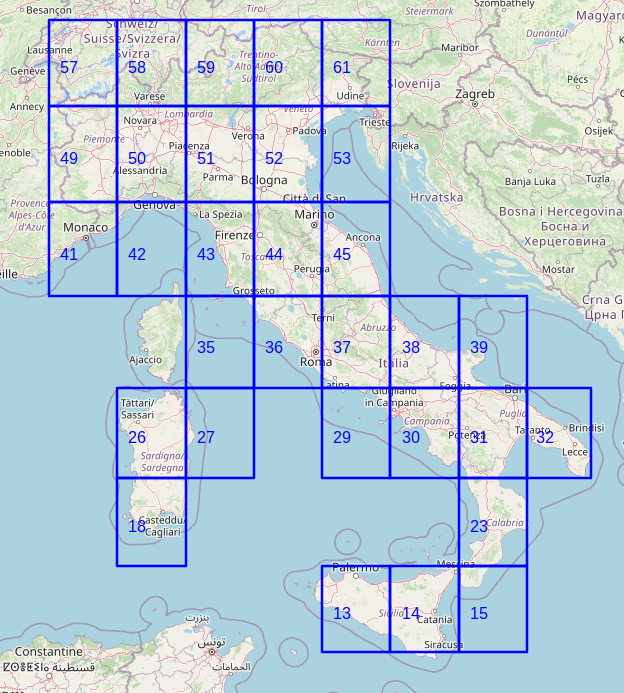

# Riconoscimento dei Segnali Stradali Italiani tramite Deep Learning: Analisi delle Fragilità Indotte da Manipolazioni e Disomogeneità Geografiche​


Il progetto costituisce un esempio di raccolta dei cartelli stradali per un territorio ben delineato e con confini complessi e strutturati come l'Italia.
Gli script raccolti sono divisi per: raccolta aree geografiche di interesse, utilizzo delle API di Mapillary e raccolta dei cartelli stradali a partire dalle immagini scaricate. 

Le bounding boxes considerate al momento sono:



## Caratteristiche del Progetto
*   **Multithreading ad Alte Prestazioni**
    Il cuore del sistema è l'elaborazione parallela: le bounding boxes vengono processate simultaneamente grazie al multithreading. Questo approccio riduce drasticamente i tempi di attesa delle chiamate API e massimizza l'utilizzo della banda disponibile, consentendo di raccogliere dati su larga scala anche su hardware modesto. I thread sono utilizzati sia sull'esecuzione parallela di più bounding boxes che sull'esecuzione delle numerose API Mapillary coinvolte per ciascuna bounding box.
*   **Generazione Dinamica delle Bounding Boxes**
    Partendo da una macro-area definita (INITIAL_BBOX), il sistema suddivide il territorio in celle, escludendo quelle che ricadono fuori dall'Italia grazie all'uso di file geojson dei confini nazionali.
*   **Dataset Strutturato e Modulabile**
    Il progetto organizza i dati in cartelle specifiche:
    *  geojson_folder: File GeoJSON che definiscono la griglia di raccolta.
    *  annotations_image: File JSON contenenti annotazioni dettagliate per ogni immagine.
    *  resized_images: Immagini ritagliate dei cartelli stradali.
    *  signal_catalog: CSV con informazioni approfondite sui cartelli.
    *  images: Immagini originali scaricate.
    *  annotations.csv: Mappa tra filename ed etichette.

## Installazione
Scaricare il progetto e configurare le variabili di ambiente nel file **.env** da creare a partire dalla copia di esempio **.env.dummy**. Nel file sono presenti valori di defaults che per un uso basico del progetto possono essere sufficienti.

Le versione delle librerie utilizzate sono compatibili con la versione `3.11` di Python.

```bash
# Creazione ambiente (da eseguire nella root del progetto)
python3.11 -m venv .venv

# Attivazione (Windows)
.venv\Scripts\activate

# Attivazione (Linux/macOS)
source .venv/bin/activate

# Installazione dipendenze
pip install -r requirements.txt

# Disattivazione
deactivate
```

## Struttura
Nel progetto sono presenti script e file per la gestione e il download dei cartelli stradali italiani, per la creazione e l'analisi del dataset. La struttura parametrica del progetto consente anche di personalizzare le aree geografiche e i cartelli da considerare.

*   **src/dataminer**: Contiene gli script principali per la raccolta e pre-elaborazione dei dati geospaziali da Mapillary.
    *   **write_bboxes.py**: Genera le coordinate delle regioni (bounding boxes) con le quali suddividere il poligono originale, definito dalla variabile d'ambiente `INITIAL_BBOX`.
    *   **bounding_boxes.py**: File auto-generato da `write_bboxes.py` che contiene le definizioni delle regioni geografiche sotto forma di un dizionario `BOUNDING_BOXES`.
    *   **utility.py**: Contiene una raccolta di funzioni e metodi di supporto che semplificano il processo di datamining dei cartelli stradali, inclusa la gestione delle cartelle, il calcolo delle coordinate dei bounding box, la creazione di file CSV e la generazione di mappe HTML.
    *   **main.py**: Il punto di ingresso principale per avviare l'elaborazione parallela delle regioni. Esegue la raccolta dei cartelli stradali avvalendosi di `dowload_bbox_images.py` (o `download_bbox_images.py` come nominato in altre fonti) per ciascuna bounding box, sfruttando il multithreading e il parametro `MAX_PARALLEL_EXECUTIONS`.
    *   **dowload_bbox_images.py**: Richiamato da `main.py` con i parametri di una specifica regione geografica, questo script utilizza `Dataminer.py` per ricavare i dati e scrivere sul disco i file relativi alle immagini raccolte. Gestisce la configurazione dei parametri di estrazione, la gestione delle cartelle di output, il download dei dati grezzi in formato GeoJSON, la selezione delle feature e il download di immagini/annotazioni, e il post-processing.
    *   **Dataminer.py**: Classe principale responsabile del download delle immagini dei cartelli stradali dall'API Mapillary. Permette la configurazione di parametri di download, la gestione di dati geospaziali e l'elaborazione di immagini e annotazioni. La classe divide la bounding box in una griglia di celle per una raccolta distribuita, e le chiamate API di Mapillary sono parallelizzate tramite thread definiti da `DATAMINER_GRID_WORKERS`.
    *   **merge_bboxes_folders.py**: Script che unisce il contenuto delle cartelle di output generate per ciascuna bounding box processata. Questo include la copia di immagini (a dimensione originale o con bounding box), GeoJSON, annotazioni e cataloghi di segnali, e la fusione dei file `annotations.csv` per creare un dataset consolidato.

*   **src/dataset**: Contiene gli script per la creazione, l'elaborazione, il clustering spaziale e l'analisi del dataset finale.
    *   **main.py**: Il punto di ingresso principale per la pipeline di creazione e analisi del dataset. Orchestrates l'esecuzione di `spatial_clustering`, `create_dataset`, `augmentations`, e `dbscan_reports`, verificando anche che il server MLflow sia attivo per il logging.
    *   **augmentations.py**: Implementa diverse tecniche di aumento dei dati (come alterazioni fotometriche, effetti atmosferici e occlusione) per arricchire il dataset esistente. Le immagini aumentate vengono salvate e i metadati aggiornati.
    *   **create_dataset.py**: Script principale per la preparazione del dataset finale. Le sue funzionalità includono l'assegnazione di ID di cluster alle immagini, l'aggiunta di codici ISTAT dei comuni e quartili di reddito basati sulla posizione, l'assegnazione di macro-aree geografiche (Nord/Centro/Sud), la suddivisione del dataset in set di training, validazione e test mantenendo la stratificazione dei cluster, la copia delle immagini nelle rispettive directory e il logging dettagliato delle informazioni del dataset su MLflow.
    *   **dbscan_reports.py**: Genera report grafici e statistiche sul dataset risultante dal clustering DBSCAN. Include heatmap dei centri dei cluster, grafici sulla cardinalità dei cluster, numero di cluster per etichetta, distribuzione delle feature per quartile di reddito e conteggio dei quartili per macro-area geografica.
    *   **spatial_clustering.py**: Questo script esegue il clustering dei cartelli stradali utilizzando l'algoritmo DBSCAN con metrica "haversine". Raggruppa le immagini che mostrano lo stesso cartello stradale in base alla loro vicinanza geografica e alla loro etichetta. Genera un report riassuntivo sui cluster e salva tutte le informazioni di clustering in un file JSON.

*   **src/resources**: Contiene file di configurazione e dati geografici di riferimento utilizzati da vari script del progetto.
    *   **limits_IT_regions.geojson**: Un file GeoJSON che contiene la definizione dei poligoni geografici che delimitano i confini delle regioni italiane. È stato scaricato da un repository Openpolis. Viene utilizzato per verificare se un punto geografico ricade all'interno dell'Italia e per la geocodifica regionale.
    *   **limits_IT_municipalities.geojson**: File GeoJSON che definisce i confini geografici dei comuni italiani. Utilizzato principalmente dal `MunicipalGeocoder` per associare le coordinate ai codici ISTAT dei comuni.
    *   **traffic-signs.txt**: File di configurazione che elenca i segnali stradali specifici da considerare e raccogliere, utilizzato da `src/dataminer/Dataminer.py` quando la configurazione `Type.CUSTOM` è selezionata.
    *   **Redditi_e_principali_variabili_IRPEF_su_base_comunale_CSV_2023.csv**: File CSV contenente dati sui redditi IRPEF a livello comunale, utilizzato per arricchire il dataset con informazioni socio-economiche associate alle aree geografiche.
    *   **signnames.csv**: File utilizzato per mappare i nomi dei segnali stradali a un indice numerico di classe, fondamentale per la preparazione del dataset per modelli di machine learning.

*   **src/utils**: Contiene funzioni di utilità e classi ausiliarie utilizzate in diverse parti del progetto.
    *   **write_bbox_map.py**: Script responsabile della generazione di una mappa HTML interattiva che visualizza le bounding boxes considerate nel progetto. Il file HTML generato (`bounding_boxes_italia.html`) viene salvato nella cartella `public/`.
    *   **MunicipalGeocoder.py**: Una classe per la geocodifica di coordinate geografiche, con lo scopo di ottenere il codice ISTAT del comune in cui una data coordinata ricade. Utilizza un approccio gerarchico, cercando prima la regione e poi il comune al suo interno.
    *   **RegionGeocoder.py**: Una classe che consente di geocodificare coordinate geografiche per ottenere informazioni sulla regione, inclusi il nome, la macro-area geografica (Nord, Centro, Sud, basata su una ripartizione ufficiale) e il codice ISTAT della regione stessa.

*   **src/models**: Contiene un notebook Python per l'addestramento e la validazione dei modelli Deep Learning, utilizzando i dataset prodotti precedentemente. Nell cartella `models` è presente il file `README.models.md` che descrive come avviare i docker container per utilizzare notebook Python

## Variabili d'ambiente

| Variabile                       | Descrizione                                                                                                                                                                                                                                                                                                                                                                                                                                                                                                                           |
| :------------------------------ | :------------------------------------------------------------------------------------------------------------------------------------------------------------------------------------------------------------------------------------------------------------------------------------------------------------------------------------------------------------------------------------------------------------------------------------------------------------------------------------------------------------------------------------ |
| **BASE_DIR**                    | **Cartella radice del progetto**. Viene utilizzata per definire percorsi base all'interno del sistema.                                                                                                                                                                                                                                                                                                                                                                                         |
| **MAPILLARY_API_KEY**           | Il tuo **Personal Token di Mapillary**, necessario per l'autenticazione alle API.                                                                                                                                                                                                                                                                                                                                                                                                                                                     |
| **GEOJSON_ITALY_PATH**          | Il percorso del **file GeoJSON che definisce i confini nazionali**. Attualmente, l'unico file fornito è `src/resources/limits_IT_regions.geojson`.                                                                                                                                                                                                                                                                                                                                                                            |
| **DOWNLOAD_BBOX_IMAGES_PATH**   | Il **percorso assoluto che indirizza al file `src/dataminer/download_bbox_images.py`**.                                                                                                                                                                                                                                                                                                                                                                                                                                              |
| **MERGE_FULLSIZE_IMAGES**       | Un valore booleano (`true`/`false`) utilizzato da `src/utils/merge.py`. Se impostato a `true`, **implica l'unione delle cartelle dei bounding box contenenti le immagini originali** scaricate da Mapillary. È consigliato impostarlo a `false` per risparmiare spazio e tempo, a meno che non si modifichi lo script `src/dataminer/download_bbox_images.py`.                                                                                                                                                            |
| **MERGE_BOUNDED_IMAGES**        | Simile a `MERGE_FULLSIZE_IMAGES`. Un valore booleano (`true`/`false`) che, se impostato a `true`, **unisce le cartelle contenenti le immagini con i bounding box disegnati**. Va valorizzato solo se sono necessari ulteriori dati, poiché impatta sullo spazio di archiviazione del sistema.                                                                                                                                                                                                                                   |
| **INITIAL_BBOX**                | Le **coordinate iniziali che delimitano la macro-regione** dalla quale vengono derivati i bounding box più piccoli.                                                                                                                                                                                                                                                                                                                                                                                                                   |
| **BBOXES_TO_REMOVE**            | Una **lista di ID dei bounding box da escludere** dalla raccolta dati. Per il territorio italiano, questo include quelli che ricadono interamente nel Mar Mediterraneo o in territori esteri.                                                                                                                                                                                                                                                                                                                                       |
| **LAT_STEP_BBOX**               | La **dimensione del passo latitudinale per la generazione dei bounding box**. Questo valore determina l'altezza di ciascuna cella della griglia.                                                                                                                                                                                                                                                                                                                                                                                    |
| **LON_STEP_BBOX**               | La **dimensione del passo longitudinale per la generazione dei bounding box**. Questo valore determina la larghezza di ciascuna cella della griglia.                                                                                                                                                                                                                                                                                                                                                                                  |
| **NUM_FEATURES_BBOX**           | Il **numero massimo di feature (cartelli) da estrarre da ogni file GeoJSON** per singola bounding box.                                                                                                                                                                                                                                                                                                                                                                                                                                    |
| **MAX_PARALLEL_EXECUTIONS**     | Il **numero di bounding box che vengono elaborate contemporaneamente** da `main.py`. Il valore predefinito è "4", ma potrebbe non essere ottimale per tutte le architetture hardware.                                                                                                                                                                                                                                                                                                                                            |
| **DATAMINER_GRID_WORKERS**      | Il **numero di thread utilizzati per le chiamate alle API Mapillary** all'interno di ogni bounding box. Il valore predefinito è "8", che sembra essere il numero massimo di chiamate eseguibili con Mapillary e con la stessa sessione HTTP.                                                                                                                                                                                                                                                                                       |
| **ALL_SIGNS_NAME_PATH**         | Il **percorso al file di configurazione (`traffic-signs.txt`)** che elenca i nomi dei cartelli stradali personalizzati da considerare durante il data mining.                                                                                                                                                                                                                                                                                                                                                                                 |
| **NO_ASK_TO_OVWEWRITE_OLD_TESTS** | Un valore booleano (`True`/`False`) che, se impostato a `True`, **impedisce al sistema di chiedere all'utente se desidera sovrascrivere esecuzioni di test precedenti**.                                                                                                                                                                                                                                                                                                                                                              |
| **DBSCAN_DISTANCE**             | La **distanza massima (epsilon) per l'algoritmo di clustering DBSCAN**. Rappresenta il raggio massimo (in metri, convertiti in radianti) entro cui cercare altri campioni per formare un cluster.                                                                                                                                                                                                                                                                                                                               |
| **DBSCAN_MIN_SAMPLES**          | Il **numero minimo di campioni richiesti per formare una regione densa** nell'algoritmo di clustering DBSCAN.                                                                                                                                                                                                                                                                                                                                                                                                                         |
| **ITALY_HEATMAP_BBOX**          | Un **bounding box geografico (latitudine minima, longitudine minima, latitudine massima, longitudine massima) utilizzato per definire l'estensione delle heatmap** dei cluster generate per il territorio italiano.                                                                                                                                                                                                                                                                                                                      |
| **TEST_CASE_BASE_ROOT**         | La **cartella radice dove vengono salvati i dati dei casi di test**, incluse le immagini, le annotazioni e i file GeoJSON.                                                                                                                                                                                                                                                                                                                                                                                                          |
| **SEED_GROUP_SHUFFLE_DATASET**  | Il **seme per la generazione di numeri casuali utilizzato nello split stratificato del dataset** (train/validation/test), per garantire la riproducibilità delle suddivisioni.                                                                                                                                                                                                                                                                                                                                                     |
| **TEST_SIZE_DATASET**           | La **proporzione del dataset totale da destinare al set di test** durante la suddivisione stratificata.                                                                                                                                                                                                                                                                                                                                                                                                                               |
| **VAL_SIZE_DATASET**            | La **proporzione del dataset totale da destinare al set di validazione** durante la suddivisione stratificata.                                                                                                                                                                                                                                                                                                                                                                                                                         |
| **DBSCAN_JSON_CLUSTERS**        | Il **percorso al file JSON che contiene le informazioni dettagliate sui cluster identificati** dall'algoritmo DBSCAN.                                                                                                                                                                                                                                                                                                                                                                                                              |
| **APPLY_AUGMENTATIONS**         | Un valore booleano (`True`/`False`) che **controlla se le tecniche di data augmentation debbano essere applicate** al dataset.                                                                                                                                                                                                                                                                                                                                                                                                               |
| **MLFLOW_ENDPOINT**             | L'**URL dell'endpoint del server di tracciamento MLflow**, utilizzato per registrare esperimenti e modelli.
