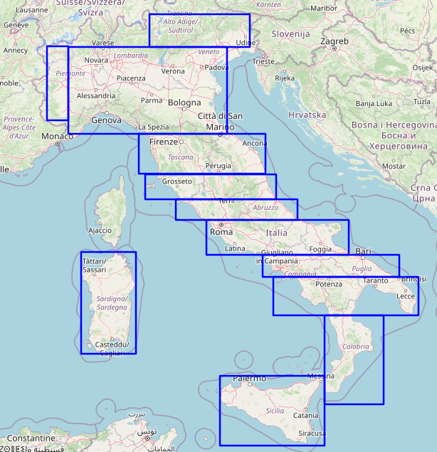

# Datamining e classificazione cartelli stradali italiani
## Installazione
Per installare il progetto clonare il repository, creare il file `.env` nella cartella principale del progetto come indicato in `.env.dummy` e configurare le librerie.
 
### Configurazione librerie
Si consiglia di gestire le librerie in ambienti virtuali, come offerto da python venv.
```bash
# Creazione ambiente (da eseguire nella root del progetto)
python -m venv .venv

# Attivazione (Windows)
.venv\Scripts\activate

# Attivazione (Linux/macOS)
source .venv/bin/activate

# Installazione dipendenze
pip install -r requirements.txt

# Disattivazione
deactivate
```
Si consiglia caldamente di non committare la cartella associata all'ambiente virtuale.

## Dataminer
La cartella Dataminer raggruppa gli script del datamining dei cartelli stradali italiani.

A partire dalle bounding boxes definite in `bounding_boxes.py`, sono eseguiti per ognuna di queste i file `Dataminer` e `utility` per memorizzare i cartelli stradali italiani in base ai parametri in essi scolpiti. 

Lo script `run_bounding_boxes` è aggiunto per facilitare il processo di datamining eseguendo la memorizzazione dei cartelli per tutte le regioni geografiche definite, una per volta. Al momento, l'unico parametro di configurazione è `NUM_FEATURES` che attesta il numero di feature da considerare per ciascuna esecuzione.

Il file `merge` facilita l'unione delle cartelle generate per ognuna delle regioni geografiche.

## Visualizzazione bounding boxes
Per visualizzare e modifica le bounding boxes considerate nel processo di datamining è fornito lo script `create_bounding_boxes_map.py` che in combinazione con `src\dataminer\bounding_boxes.py` produce in output il file `public\bounding_boxes_italia.html`.

Le bounding boxes attualmente in uso sono le seguenti:



## Da concludere: analizer2.py
### Funzionalità Principali

#### 1. **Analisi Geografica**
- Distribuzione previsioni corrette/errate (Pie Chart)
- Probabilità media per area (Bar Chart)
- Classi con maggiori errori (Stacked Bar Chart)

#### 2. **Analisi per Classe**
- Probabilità media per classe
- Classi più problematiche
- Classi meglio riconosciute

#### 3. **Analisi Feature**
- Performance per caratteristiche tecniche
- Classifica feature più affidabili

#### 4. **Analisi Statistica Avanzata**
- Distribuzione probabilità (Istogrammi)
- Identificazione outlier (Box Plot)
- Correlazione risultati-probabilità

### File di Output
| File | Descrizione |
|------|-------------|
| `pie_chart_*.png` | Distribuzione geografica risultati |
| `probabilita_media.png` | Probabilità media per area |
| `classi_*` | Analisi errori/corretti per classe |
| `performance_*` | Report prestazioni per feature |
| `*_probabilità.png` | Analisi distribuzioni probabilistiche |

### Utilizzo
1. Configurare `.env` con percorso dataset (`BASE_DIR`)
2. Posizionare il CSV dei risultati in:  
   `BASE_DIR/src/predictionToolV2/merged_file.csv`
3. Eseguire lo script per generare report e grafici

# Vecchio README
Dataminer: Tool per il mining di dataset
- test_nord.py: esempio di main, modificare le impostazioni come indicato. E' possibile replicare lo stesso main su più file .py per esecuzione parallela.
- merge.py: Tool di merge, modificare la cartella di input inserendo la stessa cartella delle esecuzioni all'interno del main
- utility.py : Contiene tutte le funzioni di ritaglio, creazione mappa e creazione CSV, nonché il mapping tra le classi di GTRSB e i nomi delle label impostate da Mapillary

predictionToolV2: Addestramento modello e classificatore immagini. E' presente anche il dataset GTRSB in formato pickle (traffic-signs-data) e i nomi delle classi presenti (signnames.csv)
- Classifier.py: contiene il codice per l'addestramento del modello e i metodi per classificare le immagini.
NB!!! - E' importante che il dataset su cui si voglia fare analisi sia completo, deve esserci il file annotations.csv all'interno del dataset, inserire il percorso del file all'interno del corrente file.
In Saved_Models c'è il modello preaddestrato che utilizza il tool (VGGNet a 12 livelli).

analizerTool: Tool che effettua i vari calcoli e crea i grafici partendo dal csv generato dal tool precedente (quello di output quindi, dopo che è stato effettuato il merge).

Test2: Dataset di segnali stradali italiani

ALTRI FILE
- custom_config.txt : file che contiene la configurazione custom dei segnali stradali. Utilizzando questo file di configurazione (o modificandolo) scarica solo i segnali le cui label sono contenute in questo file. Nella mia configurazione ci sono tutti i segnali appartenenti alle 43 classi del GTRSB
